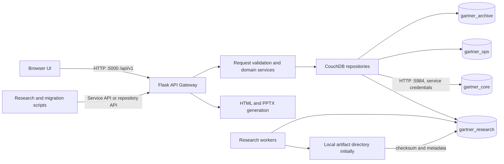
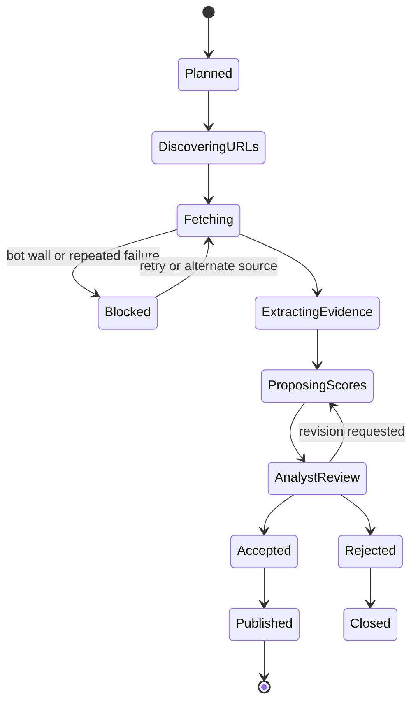
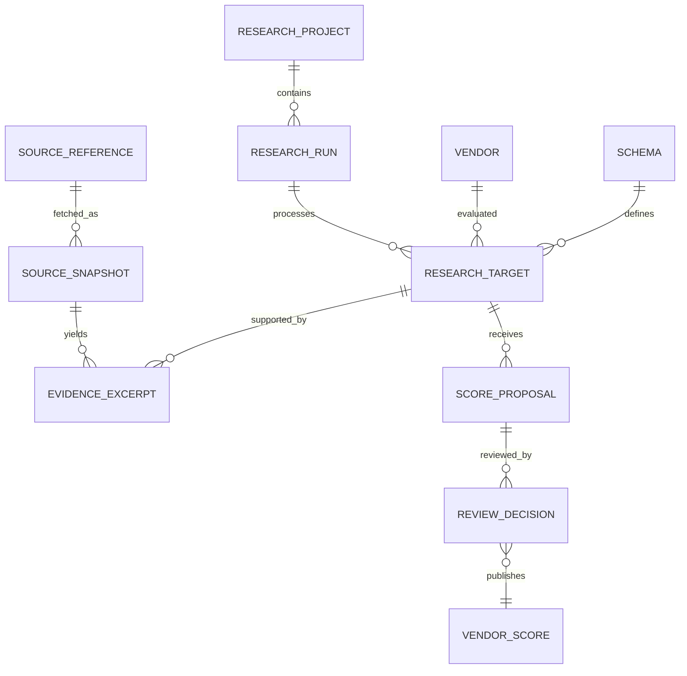
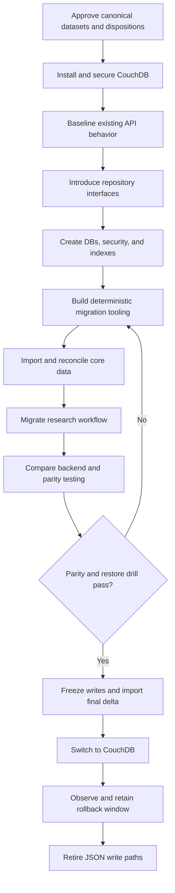

# CouchDB Migration and Research Data Platform Plan

Status: proposed implementation plan
Repository: `zanewestidealabs/Gartner-Research`
Target environment: local Windows development workstation
Application port: `5000` (Flask gateway)
CouchDB port: `5984` (localhost only)

## 1. Purpose

Replace file-based JSON persistence with a local Apache CouchDB data platform while preserving the existing Flask application, research methodology, scoring traceability, report generation, and current user experience.

This plan covers:

- Installing and securing a local single-node CouchDB instance.
- Defining databases, document contracts, identifiers, revisions, and retention rules.
- Classifying and migrating the repository's JSON datasets.
- Building a Flask API gateway and CouchDB repository layer.
- Defining required Mango indexes and queries ("Mango," not MongoDB queries).
- Refactoring the application and research scripts away from direct filesystem access.
- Preserving evidence provenance, resumability, human review, and scoring reproducibility.
- Testing, cutover, rollback, backup, documentation, and local developer tooling.

## 2. Current-State Findings

The implementation must begin from the actual repository rather than the simplified structure in the root README.

| Area | Current state |
|---|---|
| Backend | `app.py`, a roughly 7,000-line Flask application |
| Frontend | `templates/index.html`, `static/app.js`, `static/style.css` |
| Persistence | Direct `open()`, `json.load()`, and `json.dump()` calls throughout `app.py` and research scripts |
| Root JSON | 103 files, approximately 518 MB |
| All JSON | 4,252 files, approximately 647 MB |
| Schemas/frameworks | 21 root files, approximately 0.86 MB |
| Vendor/scores/pricing | 65 root files, approximately 514 MB |
| Reports/insights | 13 root files, approximately 2.31 MB |
| Research artifacts | Evidence caches, fetch results, batches, checkpoints, backups, and intermediate outputs |
| Database | None |
| Authentication | No application authentication; current endpoints include unauthenticated writes and shutdown |
| Research method | Resumable evidence harvesting, heuristic scoring, and analyst validation |

The current filenames encode data concepts that must become explicit document fields: market, schema family, version, cycle, workflow stage, research status, and whether a file is a seed, researched result, validated result, consolidated result, backup, or generated report.

## 3. Architectural Decisions

### 3.1 Decisions for the local migration

1. Use the existing Flask application as the initial API gateway.
2. Keep CouchDB private on `127.0.0.1:5984`; do not enable public or wildcard CORS.
3. Keep the web application on `127.0.0.1:5000`.
4. Do not expose CouchDB credentials or CouchDB endpoints to browser JavaScript.
5. Use CouchDB's HTTP API through a small, owned Python client instead of depending on an unmaintained ORM-style wrapper.
6. Use regular, non-partitioned databases for the first migration. Current use cases require global cross-market queries, and the local dataset does not justify partition constraints yet.
7. Split large aggregate JSON arrays into entity-sized documents. Do not store a 20-40 MB vendor file as one CouchDB document.
8. Store accepted scores separately from evidence and score proposals so analyst decisions remain auditable.
9. Treat `_rev` as an optimistic-concurrency token and surface conflicts through the gateway.
10. Every JSON file receives an explicit migration disposition; not every file becomes canonical data.
11. Preserve a temporary JSON compatibility backend until parity tests pass.
12. Keep `app.py` as a thin executable compatibility shim after modularization.

### 3.2 Target architecture



### 3.3 Proposed Python package structure

```text
app.py                         # Thin entry point; imports create_app()
gartner_app/
  __init__.py                  # Flask application factory
  config.py                    # Validated environment configuration
  api/
    health.py
    vendors.py
    schemas.py
    scores.py
    reports.py
    research.py
    admin.py
  domain/
    models.py                  # Document/request validation models
    services.py
  couchdb/
    client.py                  # HTTP/session/retry/conflict handling
    indexes.py                 # Declarative index definitions
    bootstrap.py               # DB, security, and index creation
  repositories/
    vendors.py
    schemas.py
    scores.py
    reports.py
    research.py
    ops.py
  compatibility/
    json_backend.py            # Temporary read-only legacy adapter
  migration/
    inventory.py
    classifiers.py
    transforms.py
    importer.py
    validator.py
tests/
  unit/
  integration/
  contract/
  migration/
```

## 4. Local CouchDB Installation and Configuration

Target the current stable CouchDB 3.5.x Windows binary, but resolve and pin the exact stable patch version on the day implementation begins. Record the installer URL, version, and SHA checksum in the implementation log.

### 4.1 Installation steps

- [ ] Download the official Windows binary from Apache CouchDB.
- [ ] Verify the published checksum/signature.
- [ ] Install to a path without spaces, such as `C:\CouchDB`.
- [ ] Install CouchDB as a Windows service.
- [ ] Create a non-default administrator during setup; never commit the password.
- [ ] Complete single-node setup and verify creation of `_users`, `_replicator`, and `_global_changes`.
- [ ] Verify Fauxton at `http://127.0.0.1:5984/_utils/`.
- [ ] Verify `GET /` returns the installed version.
- [ ] Record the Windows service name and start/stop commands in `docs/local-development.md`.

Official setup guidance: [Windows installation](https://docs.couchdb.org/en/stable/install/windows.html) and [single-node setup](https://docs.couchdb.org/en/stable/setup/single-node.html).

### 4.2 Security baseline

- [ ] Set `[chttpd] bind_address = 127.0.0.1`.
- [ ] Keep port `5984` inaccessible from other network interfaces.
- [ ] Keep CORS disabled because the gateway is the only CouchDB client.
- [ ] Create a gateway service user separate from the CouchDB administrator.
- [ ] Create database roles: `gartner_reader`, `gartner_writer`, `gartner_researcher`, and `gartner_admin`.
- [ ] Apply `_security` objects immediately after database creation; an empty members list can leave a database broadly accessible.
- [ ] Give the gateway only the database roles it needs.
- [ ] Reserve administrator credentials for bootstrap, backup, and maintenance scripts.
- [ ] Store secrets in ignored `.env`, Windows Credential Manager, or an equivalent local secret provider.
- [ ] Add `.env.example` containing names and safe placeholders only.
- [ ] Disable or protect `/api/shutdown` before the gateway becomes the primary persistence path.
- [ ] Add request-size limits, JSON content-type checks, and structured audit logging.

Official references: [HTTP binding and CORS](https://docs.couchdb.org/en/stable/config/http.html), [database security](https://docs.couchdb.org/en/stable/api/database/security.html), and [authentication](https://docs.couchdb.org/en/stable/api/server/authn.html).

### 4.3 Environment variables

```dotenv
DATA_BACKEND=json
COUCHDB_URL=http://127.0.0.1:5984
COUCHDB_USERNAME=gartner_gateway
COUCHDB_PASSWORD=<local-secret>
COUCHDB_CORE_DB=gartner_core
COUCHDB_RESEARCH_DB=gartner_research
COUCHDB_OPS_DB=gartner_ops
COUCHDB_ARCHIVE_DB=gartner_archive
COUCHDB_CONNECT_TIMEOUT_SECONDS=3
COUCHDB_READ_TIMEOUT_SECONDS=30
```

Never place credentials in a URL written to logs. The client should construct HTTP Basic authentication headers internally and redact authentication data from exceptions.

## 5. Database Boundaries

Database names must be lowercase and lifecycle-oriented.

| Database | Purpose | Primary retention |
|---|---|---|
| `gartner_core` | Canonical vendors, schemas, accepted scores, pricing, insights, reports, profiles, frameworks, and app configuration | Long-lived |
| `gartner_research` | Research projects, runs, targets, sources, snapshots, evidence, score proposals, review decisions, annotations, and checkpoints | Policy driven; evidence retained with accepted scores |
| `gartner_ops` | Import manifests, batches, dead letters, gateway audit events, idempotency records, and generated artifact metadata | Operational retention |
| `gartner_archive` | Legacy JSON blobs or normalized historical versions that must be retained but are not active | Read-only after migration |

Do not create one database per vendor, schema, or source file. That pattern makes security, compaction, indexing, and cross-market queries unnecessarily difficult.

## 6. Shared Document Contract

Every owned document should use a common envelope.

```json
{
  "_id": "vendor:crowdstrike",
  "doc_type": "vendor",
  "schema_version": 1,
  "status": "active",
  "created_at": "2026-07-22T00:00:00Z",
  "created_by": "migration:v1",
  "updated_at": "2026-07-22T00:00:00Z",
  "updated_by": "migration:v1",
  "source": {
    "kind": "legacy_json",
    "path": "Vendor 3-7.json",
    "sha256": "...",
    "import_batch_id": "import:2026-07-22:001"
  }
}
```

Rules:

- `_id` is deterministic, lowercase where practical, stable, and independent of filenames.
- `doc_type` is mandatory and immutable.
- `schema_version` versions the document contract, not the research schema being evaluated.
- All timestamps use UTC ISO 8601.
- `_rev` is supplied on updates and returned as an ETag by the gateway.
- Deletes are soft deletes by default (`status: archived`); CouchDB tombstones are reserved for retention enforcement.
- File provenance is retained at import time.
- Documents reference other documents by stable IDs, not embedded filenames.
- Large logical aggregates are split so ordinary reads and updates remain bounded.

## 7. Required Document Types

### 7.1 `gartner_core`

| `doc_type` | Purpose | Suggested ID |
|---|---|---|
| `vendor` | Canonical identity, aliases, URLs, geography, metadata | `vendor:<slug>` |
| `schema` | Versioned scoring taxonomy and definitions | `schema:<market>:<version>` |
| `vendor_score` | Accepted score set for one vendor/schema/cycle | `score:<market>:<cycle>:<vendor>` |
| `vendor_pricing` | Versioned pricing facts and confidence | `pricing:<market>:<cycle>:<vendor>` |
| `market_insight` | Perspective-specific market insight content | `insight:<market>:<perspective>:<version>` |
| `analyst_take` | Analyst narrative and linked evidence | `analyst-take:<market>:<perspective>:<version>` |
| `mq_score` | Magic Quadrant gap or comparison scores | `mq-score:<market>:<cycle>:<vendor>` |
| `innovation_profile` | Innovation profile records | `innovation:<slug>:<version>` |
| `framework` | ASMF and other reference frameworks | `framework:<slug>:<version>` |
| `adoption_plan` | Adoption-plan configuration and mappings | `adoption-plan:<framework>:<version>` |
| `report_definition` | Structured report content used by routes | `report:<market>:<type>:<version>` |
| `app_config` | Active schema/cycle and safe feature configuration | `config:<scope>` |

### 7.2 `gartner_research`

| `doc_type` | Purpose | Suggested ID |
|---|---|---|
| `research_project` | Market/schema/cycle research initiative | `project:<market>:<cycle>` |
| `research_run` | One reproducible execution of a pipeline | `run:<uuid>` |
| `research_target` | Vendor and criterion work unit | `target:<project>:<vendor>:<criterion>` |
| `source_reference` | Canonical URL/document metadata | `source:<sha256-canonical-url>` |
| `source_snapshot` | Fetch/render result metadata and content hash | `snapshot:<sha256-content>` |
| `evidence_excerpt` | Immutable excerpt linked to source, vendor, and criterion | `evidence:<uuid>` |
| `score_proposal` | Machine/heuristic score with rationale | `proposal:<run>:<vendor>:<criterion>` |
| `review_decision` | Analyst accept/reject/edit decision | `decision:<proposal>:<revision>` |
| `research_checkpoint` | Resumable cursor and completed work units | `checkpoint:<run>:<stage>` |
| `research_job` | Queued/running/completed task state | `job:<uuid>` |
| `annotation` | Analyst notes attached to a target | `annotation:<uuid>` |
| `research_policy` | Versioned curation/scoring/bot-wall rules | `policy:<name>:<version>` |

### 7.3 `gartner_ops`

| `doc_type` | Purpose |
|---|---|
| `migration_manifest` | One record per source file with checksum and disposition |
| `import_batch` | Batch status, counts, timing, and errors |
| `dead_letter` | Source record that failed validation or import |
| `audit_event` | Actor, action, target, before/after revision IDs |
| `idempotency_record` | Prevent duplicate POST execution |
| `generated_artifact` | PPTX/HTML export metadata, checksum, and path |
| `health_snapshot` | Optional scheduled operational health record |

### 7.4 `gartner_archive`

| `doc_type` | Purpose |
|---|---|
| `legacy_dataset` | Historical file content retained intact when normalization has no immediate value |
| `legacy_record` | Individual normalized record from a superseded dataset |
| `legacy_asset_manifest` | Metadata-only record for excluded cache/backup artifacts |

## 8. Research Methodology Preservation

The database migration must strengthen, not flatten, the existing methodology.

### 8.1 Required research invariants

- Evidence is immutable after capture. Corrections create a new evidence document and supersede the old one.
- A source URL is not evidence by itself; retain retrieval time, content hash, render method, HTTP status, and bot-wall assessment.
- Excerpts retain source/snapshot IDs, exact text, locator/offset where possible, criterion, and extraction method.
- Score proposals remain distinct from accepted `vendor_score` documents.
- Every proposal records algorithm/rubric version, schema ID, run ID, code commit, model/prompt identifiers when applicable, confidence, and rationale.
- Analyst review records accept, reject, or edit decisions without overwriting the original proposal.
- Checkpoints track stage and work-unit completion so pipelines can resume safely.
- A cache miss or expired snapshot never silently deletes historical evidence.
- Marketing-only evidence and bot-wall failures remain explicit quality signals.
- Published scores must be reconstructable from reviewed evidence and decisions.

### 8.2 Research flow



### 8.3 Evidence relationship model



### 8.4 Artifact policy

Every current JSON file must be classified into one of these dispositions:

1. **Normalize to core**: active schemas, canonical vendors, accepted scores, pricing, reports, and frameworks.
2. **Normalize to research**: sources, evidence, targets, batches, checkpoints, proposals, and review results.
3. **Archive intact**: historical versions needed for provenance but not active querying.
4. **Manifest only**: reproducible caches, duplicate backups, generated diagnostics, and temporary files after owner approval.
5. **Dead letter**: invalid JSON or records that cannot meet a document contract.

Raw HTML, PDF, DOCX, and large generated artifacts should remain outside normal CouchDB documents. Initially use a local ignored artifact directory with content-addressed paths; store metadata and SHA-256 hashes in CouchDB. CouchDB attachments may be evaluated for small immutable artifacts, but must not become the default for hundreds of megabytes of scrape data.

## 9. Mango Index and Query Plan

CouchDB's query system is called Mango. Each production query must have an explicit JSON index, a stable query name, and an `_explain` assertion in integration tests. See [Mango queries and indexes](https://docs.couchdb.org/en/stable/ddocs/mango.html) and [`_find`](https://docs.couchdb.org/en/stable/api/database/find.html).

### 9.1 Core indexes

| Index name | Fields | Supports |
|---|---|---|
| `idx_vendor_status_name` | `doc_type`, `status`, `name_normalized` | Vendor list/search prefix |
| `idx_vendor_market` | `doc_type`, `status`, `markets` | Vendors participating in a market |
| `idx_schema_market_status_version` | `doc_type`, `market`, `status`, `version_sort` | Published schema selection |
| `idx_score_market_cycle_vendor` | `doc_type`, `market`, `cycle`, `vendor_id` | Score list and vendor detail |
| `idx_score_vendor_schema_cycle` | `doc_type`, `vendor_id`, `schema_id`, `cycle` | Vendor history |
| `idx_pricing_market_cycle_vendor` | `doc_type`, `market`, `cycle`, `vendor_id` | Pricing route |
| `idx_insight_market_type_perspective` | `doc_type`, `market`, `report_type`, `perspective`, `status` | Insight/report APIs |
| `idx_mq_market_cycle_vendor` | `doc_type`, `market`, `cycle`, `vendor_id` | MQ score APIs |

Example index:

```json
{
  "index": {
    "fields": ["doc_type", "market", "cycle", "vendor_id"]
  },
  "ddoc": "idx-score-market-cycle-vendor",
  "name": "idx_score_market_cycle_vendor",
  "type": "json",
  "partial_filter_selector": {
    "doc_type": "vendor_score"
  }
}
```

Example score query:

```json
{
  "selector": {
    "doc_type": "vendor_score",
    "market": "mdr",
    "cycle": "2026",
    "status": "published"
  },
  "fields": ["_id", "_rev", "vendor_id", "schema_id", "pillar_scores", "updated_at"],
  "limit": 200,
  "use_index": ["idx-score-market-cycle-vendor", "idx_score_market_cycle_vendor"]
}
```

### 9.2 Research indexes

| Index name | Fields | Supports |
|---|---|---|
| `idx_project_market_cycle_status` | `doc_type`, `market`, `cycle`, `status` | Project dashboard |
| `idx_run_project_status_created` | `doc_type`, `project_id`, `status`, `created_at` | Run history |
| `idx_target_project_vendor_status` | `doc_type`, `project_id`, `vendor_id`, `status` | Work queue |
| `idx_source_canonical_url` | `doc_type`, `canonical_url` | Source deduplication |
| `idx_snapshot_source_retrieved` | `doc_type`, `source_id`, `retrieved_at` | Snapshot history |
| `idx_evidence_vendor_schema_criterion` | `doc_type`, `vendor_id`, `schema_id`, `criterion_id` | Evidence lookup |
| `idx_evidence_snapshot` | `doc_type`, `snapshot_id` | Snapshot lineage |
| `idx_proposal_run_vendor_criterion` | `doc_type`, `run_id`, `vendor_id`, `criterion_id` | Scoring output |
| `idx_proposal_review_status` | `doc_type`, `review_status`, `created_at` | Analyst review queue |
| `idx_checkpoint_run_stage` | `doc_type`, `run_id`, `stage` | Resume workflow |
| `idx_job_status_updated` | `doc_type`, `status`, `updated_at` | Job monitoring |

Example analyst review queue:

```json
{
  "selector": {
    "doc_type": "score_proposal",
    "review_status": "pending",
    "project_id": "project:precyber:2026"
  },
  "sort": [{"created_at": "asc"}],
  "limit": 50,
  "bookmark": "<opaque-bookmark-from-previous-response>"
}
```

Example evidence query:

```json
{
  "selector": {
    "doc_type": "evidence_excerpt",
    "vendor_id": "vendor:crowdstrike",
    "schema_id": "schema:mdr:2.1",
    "criterion_id": "detection.alert_fidelity",
    "status": {"$ne": "superseded"}
  },
  "fields": ["_id", "_rev", "snapshot_id", "text", "quality", "retrieved_at"],
  "limit": 100
}
```

### 9.3 Query rules

- [ ] Never rely on `_all_docs` for application filtering.
- [ ] Require `doc_type` in every mixed-database selector.
- [ ] Use projection through `fields` for list endpoints.
- [ ] Paginate with Mango bookmarks, not numeric offsets.
- [ ] Reject unbounded client-defined selectors.
- [ ] Allowlist filter and sort fields per endpoint.
- [ ] Run `POST /{db}/_explain` in tests and fail if the intended index is not selected.
- [ ] Capture execution statistics during performance testing.
- [x] Add indexes through idempotent bootstrap code, not manually in Fauxton.
- [x] Treat indexes as source-controlled infrastructure.
- [ ] Evaluate partial indexes for high-volume document types.

## 10. API Gateway Plan

The gateway preserves the current browser contract initially and introduces a versioned API for normalized resources.

### 10.1 Gateway responsibilities

- Authenticate the caller when authentication is introduced.
- Validate paths, query parameters, and request bodies.
- Enforce document type and field allowlists.
- Hide CouchDB URL, credentials, database names, and raw errors.
- Convert `_rev` to/from HTTP `ETag` and `If-Match`.
- Enforce idempotency for retried POST operations.
- Translate CouchDB conflicts into HTTP `409 Conflict`.
- Apply pagination limits and return opaque bookmarks.
- Record write audit events.
- Coordinate multi-document workflows using explicit state transitions and compensating actions; CouchDB does not provide cross-document transactions.
- Provide `/health/live` and `/health/ready` endpoints.

### 10.2 Versioned resource API

```text
GET    /api/v1/vendors
GET    /api/v1/vendors/{vendor_id}
POST   /api/v1/vendors
PATCH  /api/v1/vendors/{vendor_id}

GET    /api/v1/schemas
GET    /api/v1/schemas/{schema_id}
POST   /api/v1/schemas
PATCH  /api/v1/schemas/{schema_id}
POST   /api/v1/schemas/{schema_id}/publish

GET    /api/v1/scores
GET    /api/v1/scores/{score_id}
PUT    /api/v1/scores/{score_id}

GET    /api/v1/research/projects
POST   /api/v1/research/projects
GET    /api/v1/research/runs/{run_id}
POST   /api/v1/research/runs
POST   /api/v1/research/runs/{run_id}/resume
GET    /api/v1/research/evidence
POST   /api/v1/research/evidence
GET    /api/v1/research/review-queue
POST   /api/v1/research/proposals/{proposal_id}/decision

GET    /api/v1/admin/migrations/{batch_id}
POST   /api/v1/admin/reindex
GET    /api/v1/admin/health/couchdb
```

### 10.3 Compatibility route migration

Map each current route to a repository/service before changing its response shape.

| Existing route family | New repository/service |
|---|---|
| `/api/vendors`, `/api/field-values/*` | Vendor and score query service |
| `/api/vendor-files`, `/api/switch-vendor-file` | Active dataset/cycle configuration service |
| `/api/schema-*`, `/api/sub-pillars` | Schema repository |
| `/api/*-pricing`, `/api/*-mq-scores` | Pricing/MQ repositories |
| `/api/*-market-insight` | Market insight repository |
| `/api/analyst-take*` | Analyst take repository |
| `/api/reports`, `/api/report/*` | Report definition repository |
| PPTX endpoints | Read-only report composition service backed by repositories |
| `/api/innovation-profiles` | Innovation profile repository |
| `/api/asmf-*`, `/api/docs/*` | Framework/document repository |

## 11. Application Refactor Sequence

### Phase A: Characterize and protect current behavior

- [ ] Add contract tests for every current GET and POST route.
- [ ] Capture representative response fixtures by market/schema without storing secrets.
- [ ] Add tests for report and PPTX generation.
- [ ] Fix or quarantine the existing syntax error in `_add_killchain_v2_report.py` before requiring full-repo compilation in CI.
- [ ] Add JSON schema validation for current authoritative input files.
- [ ] Identify which versioned vendor/schema file is active for every market.

Acceptance: current JSON backend passes a documented baseline suite.

### Phase B: Introduce configuration and repositories

- [ ] Create the Flask application factory.
- [ ] Add validated settings and `.env.example`.
- [ ] Define repository protocols/interfaces for all data families.
- [ ] Move existing filesystem logic into `Json*Repository` implementations without changing behavior.
- [ ] Replace direct file operations in route handlers with repository calls.
- [x] Add `DATA_BACKEND=json|couchdb|compare`.

Acceptance: the app still runs from JSON, but route handlers contain no direct persistence logic.

### Phase C: Build CouchDB infrastructure

- [x] Implement the HTTP client with connection pooling, authentication, timeouts, bounded retries, and redacted errors.
- [x] Implement database/bootstrap creation.
- [x] Apply `_security` definitions.
- [x] Create all source-controlled Mango indexes.
- [x] Implement typed CouchDB repositories.
- [x] Add health and readiness checks.

Acceptance: integration tests can create isolated test databases, CRUD each document type, and clean them up.

### Phase D: Build migration tooling

- [x] Create a complete inventory manifest for all 4,249 application JSON files.
- [x] Record path, size, modified time, SHA-256, parse status, top-level shape, inferred family, and disposition.
- [x] Record active/canonical designations for application-used version families.
- [x] Create deterministic transformers for the selected canonical families.
- [x] Split aggregate vendor arrays into canonical vendor, score, pricing, evidence, and report documents.
- [ ] Deduplicate vendors using normalized name, aliases, website domain, and explicit review overrides.
- [ ] Deduplicate sources using canonical URL and snapshots using content hash.
- [x] Use `_bulk_docs` in bounded batches and inspect every item result for errors; a bulk request is not an all-or-nothing transaction.
- [ ] Persist checkpoints after each successful batch.
- [ ] Write invalid records to `dead_letter` with validation errors and source provenance.
- [x] Make reruns idempotent through deterministic IDs and source hashes.

Official reference: [`_bulk_docs`](https://docs.couchdb.org/en/stable/api/database/bulk-api.html).

Acceptance: repeated dry runs produce identical planned IDs and counts; repeated imports produce no duplicate logical records.

### Phase E: Migrate research workflows

- [ ] Refactor all URL-discovery workers to create/update `source_reference`
  documents. The primary PreCyber evidence, direct Playwright, and SVC/pricing
  workers are complete.
- [ ] Refactor all fetch/render stages to create immutable `source_snapshot`
  records. The primary urllib/cache, direct Playwright, and SVC/pricing paths
  are complete; other market-specific workers remain.
- [x] Move batch state into `research_run`, `research_target`, and `research_checkpoint` documents.
- [x] Store extracted evidence as independent `evidence_excerpt` documents.
- [x] Store heuristic/LLM results as `score_proposal`, never directly as accepted scores.
- [x] Implement analyst review decisions and publication to `vendor_score`.
- [ ] Preserve bot-wall, retry, URL-curation, and evidence-quality rules from `PreCyber_Research_Standard.md`.
- [x] Store pipeline version, Git commit, schema ID, and model/prompt metadata on every run.
- [ ] Add an explicit versioned `research_policy` link to every production run.
  The contract, immutable policy document, and lineage verification are
  complete.
- [ ] Add a lease/heartbeat field if multiple workers may claim jobs later.

Primary PreCyber checkpoint and scoring conversion is complete: evidence and
SVC/pricing workers select CouchDB checkpoints when explicit project/run IDs
are provided, and the strict scorer resolves successful snapshots into
independent evidence and deterministic score proposals. Remaining work under
this phase is conversion of other market-specific workers and optional
multi-worker lease/heartbeat support.

Acceptance: **passed 2026-07-22.** Live run
`research_run:fb0cc1d5-1b4e-44f6-a25e-32a3b2b38a34` stopped, resumed, produced
three immutable evidence records, entered analyst review, and published three
accepted scores without filesystem state.

### Phase F: Compare and cut over

- [x] Import an immutable snapshot of the selected canonical JSON files.
- [x] Run `DATA_BACKEND=compare`: serve JSON results while querying CouchDB and logging semantic differences.
- [x] Compare counts, IDs, score values, schema definitions, report content, and representative response hashes.
- [x] Resolve every unexplained difference.
- [x] Freeze writes briefly for final delta import.
- [x] Switch to `DATA_BACKEND=couchdb`.
- [x] Keep JSON files read-only for at least one validated rollback window.
- [ ] Remove JSON write paths only after signoff.

Acceptance: route contract suite and browser smoke tests pass against CouchDB with zero unexplained parity differences.

### Phase G: Retire legacy file access

- [x] Remove filesystem discovery endpoints or redefine them as dataset/cycle selectors.
- [x] Remove direct JSON writes from the app and research scripts.
- [ ] Move superseded JSON files to the archive policy selected by the owner.
- [x] Keep migration manifests and hashes permanently.
- [x] Update README, deployment docs, and troubleshooting guidance.

## 12. Migration Validation and Reconciliation

Validation must be both structural and semantic.

### 12.1 Structural checks

- Source file count by disposition equals inventory total.
- Every parsed source file has a migration manifest.
- Every imported record has source provenance.
- Every document passes its contract schema.
- No logical IDs are duplicated across batches.
- No document exceeds the agreed size threshold without an exception record.
- Every bulk item response is checked.

### 12.2 Semantic checks

- Vendor counts and normalized identities match approved source sets.
- Schema pillar/sub-pillar counts and definitions match.
- Scores, rationales, confidence, and evidence links match.
- Pricing structures and MQ gap scores match.
- Reports and perspective variants match.
- Research checkpoints resume from the same logical position.
- Generated PPTX/HTML outputs remain functionally equivalent.

### 12.3 Reconciliation report

Generate a machine-readable and Markdown report containing:

- Files processed/skipped/failed by disposition.
- Documents created/updated/conflicted by type.
- Duplicate vendor/source groups requiring review.
- Schema and score parity results.
- Dead letters with remediation owner.
- Query/index explain results.
- Performance results before and after migration.

## 13. Testing Strategy

### 13.1 Unit tests

- Document ID generation and slug stability.
- Each legacy file transformer.
- Validation models and state transitions.
- Query construction allowlists.
- Conflict/error mapping.
- Research scoring and provenance preservation.

### 13.2 Integration tests

- Database/security/index bootstrap.
- CRUD and `_rev` conflict behavior.
- Mango index selection through `_explain`.
- Pagination/bookmarks.
- Bulk import partial failures and resume.
- Gateway authentication/authorization hooks.
- Research stop/resume/idempotency.
- Backup and restore drill.

### 13.3 Contract and end-to-end tests

- Current route response compatibility.
- Browser dashboard/vendor/schema workflows.
- All current write endpoints.
- Market insight editing.
- PPTX/report generation.
- CouchDB unavailable, slow, unauthorized, and conflict scenarios.

### 13.4 Performance gates

- Define p95 targets for vendor lists, score detail, schema load, and research queue.
- Test with the full migrated dataset, not toy fixtures.
- Confirm no endpoint performs unindexed full scans.
- Measure index build size and duration.
- Leave enough free disk for compaction, which can require roughly twice the active database/view file space. See [CouchDB compaction](https://docs.couchdb.org/en/stable/maintenance/compaction.html).

## 14. Backup, Restore, and Maintenance

- [x] Keep automatic compaction enabled initially.
- [x] Monitor database sizes, index sizes, document counts, and compaction status.
- [ ] Implement a nightly backup to storage outside the CouchDB data directory.
- [ ] Prefer replication to a separate CouchDB instance for a true CouchDB-native backup; replication to another database on the same node is not disaster recovery.
- [ ] Back up CouchDB configuration alongside data.
- [x] Document and automate restore into a clean local instance.
- [x] Run a restore drill before deleting or archiving source JSON files.
- [x] Retain the original migration snapshot and manifest until final acceptance.

Official guidance: [Backing up CouchDB](https://docs.couchdb.org/en/stable/maintenance/backups.html).

## 15. Dependencies and Developer Tooling

### 15.1 Proposed Python runtime dependencies

Add only after implementation begins and pin compatible versions:

- `requests` or `httpx` for the CouchDB HTTP client (choose one).
- `pydantic` for request/document contract validation.
- `python-dotenv` for local non-secret configuration loading.

Development dependencies:

- `pytest`
- `pytest-cov`
- `responses` or `respx`, matching the selected HTTP client
- `ruff`
- `jsonschema` if external JSON Schema files are used in addition to Pydantic

Create `requirements-dev.txt` or migrate dependency management to `pyproject.toml`; do not mix both approaches without a documented source of truth.

### 15.2 VS Code extensions

Add these recommendations to `.vscode/extensions.json` during implementation:

```json
{
  "recommendations": [
    "ms-python.python",
    "ms-python.vscode-pylance",
    "ms-python.debugpy",
    "bierner.markdown-mermaid",
    "yzhang.markdown-all-in-one",
    "humao.rest-client"
  ]
}
```

Optional only if Docker-based test instances are adopted:

- `ms-azuretools.vscode-docker`
- `redhat.vscode-yaml`

Add `.http` request collections for gateway health, representative CRUD, conflict, pagination, research, and admin operations. Collections must reference environment variables and never contain credentials.

## 16. Source-Controlled Deliverables

- [x] `COUCHDB_MIGRATION_PLAN.md` (this plan)
- [x] `docs/couchdb-document-contracts.md`
- [x] `docs/research-state-machine.md`
- [x] `docs/local-development.md`
- [x] `.env.example`
- [x] CouchDB bootstrap/index/security definitions
- [x] Migration inventory and classifier configuration
- [x] Migration/reconciliation CLI
- [x] Gateway/repository modules
- [x] Unit, integration, contract, and end-to-end tests
- [x] Backup and restore scripts
- [x] API request collection
- [x] Updated README and architecture diagrams

## 17. Implementation Order and Gates



Do not begin destructive cleanup of JSON files before all of these gates pass:

1. Canonical file/version selections are approved.
2. Full inventory and checksums are stored outside the source files.
3. Migration is repeatable and idempotent.
4. API parity tests pass.
5. Research dry-run/resume/review/publish flow passes.
6. Backup restore succeeds into a clean instance.
7. Rollback procedure is tested.
8. Owner signs off on archive and deletion dispositions.

## 18. Rollback Plan

- Keep `DATA_BACKEND=json` operational throughout development.
- Keep an immutable pre-migration JSON snapshot.
- During compare mode, serve JSON until differences are resolved.
- At cutover, record the final imported source hashes and CouchDB update sequences.
- If a blocking issue occurs, stop writes, export any CouchDB-only writes through a reconciliation tool, switch back to JSON, and document the delta.
- Do not attempt long-term dual writes without an outbox/reconciliation design; independent writes to CouchDB and files can diverge.
- Preserve CouchDB databases after rollback for analysis rather than deleting them.

## 19. Decisions Required Before Implementation

- [x] Identify the canonical active vendor/score/pricing file for every currently implemented market.
- [x] Decide which historical versions require queryable normalized records versus archive-only storage.
- [x] Confirm whether scrape-cache JSON must be retained, deduplicated, or reproducible and therefore manifest-only.
- [x] Define research evidence, snapshot, and audit retention periods.
- [x] Decide whether original HTML/PDF/DOCX artifacts remain on local disk or move to an object store later.
- [x] Define local application roles and whether multi-user authentication is part of this migration.
- [x] Approve stable ID rules for vendors with renamed/rebranded entities.
- [x] Define the official market/cycle vocabulary.
- [x] Decide whether the current large `PLATFORM_ARCHITECTURE.md` future-state Fastify/React design remains a later phase or should supersede the Flask-first gateway after local cutover.

Adopted local-cutover defaults:

- Superseded versions are archive-only unless the canonical manifest explicitly
  promotes them.
- Scrape caches are manifest-only after snapshot/evidence import; retained
  legacy files remain rollback artifacts during acceptance.
- Accepted evidence and review decisions are retained for the life of the
  research product, snapshots for seven years, and operational audit events for
  two years. No automatic deletion is enabled.
- Original binary artifacts remain on local disk; object storage is a later
  deployment phase.
- The local gateway uses one restricted CouchDB service identity. Multi-user
  authentication is outside this single-user local migration.
- Vendor IDs use normalized identity, aliases, website domain, and explicit
  review overrides for rebrands.
- Market and cycle values are governed by
  `migration/canonical_sources.json`.
- Flask-first is the completed local gateway. The Fastify/React architecture
  remains a future phase.

## 20. Definition of Done

The migration is complete only when:

- CouchDB is installed as a secured localhost-only Windows service.
- Required databases, security objects, document contracts, and indexes are reproducibly bootstrapped.
- Every repository JSON file has an approved migration disposition and checksum manifest.
- Canonical schemas, vendors, scores, pricing, reports, frameworks, and research records are migrated and reconciled.
- The Flask application performs no production data reads or writes directly against JSON files.
- The browser has no CouchDB credentials or direct CouchDB access.
- All gateway queries are validated, bounded, indexed, and covered by tests.
- Research workflows are resumable, evidence-preserving, reviewable, and reproducible.
- Current UI, API, and report-generation behavior passes parity testing.
- Backup and restore are automated and tested.
- Cutover and rollback are documented and rehearsed.
- Legacy JSON write paths are disabled, with source artifacts archived according to approved policy.

## 21. Official CouchDB References

- [Apache CouchDB documentation](https://docs.couchdb.org/en/stable/)
- [Windows installation](https://docs.couchdb.org/en/stable/install/windows.html)
- [Single-node setup](https://docs.couchdb.org/en/stable/setup/single-node.html)
- [Mango queries and indexes](https://docs.couchdb.org/en/stable/ddocs/mango.html)
- [`_find` API](https://docs.couchdb.org/en/stable/api/database/find.html)
- [`_bulk_docs` API](https://docs.couchdb.org/en/stable/api/database/bulk-api.html)
- [Database security](https://docs.couchdb.org/en/stable/api/database/security.html)
- [HTTP binding and CORS](https://docs.couchdb.org/en/stable/config/http.html)
- [Partitioned databases](https://docs.couchdb.org/en/stable/partitioned-dbs/index.html)
- [Compaction](https://docs.couchdb.org/en/stable/maintenance/compaction.html)
- [Backup](https://docs.couchdb.org/en/stable/maintenance/backups.html)
