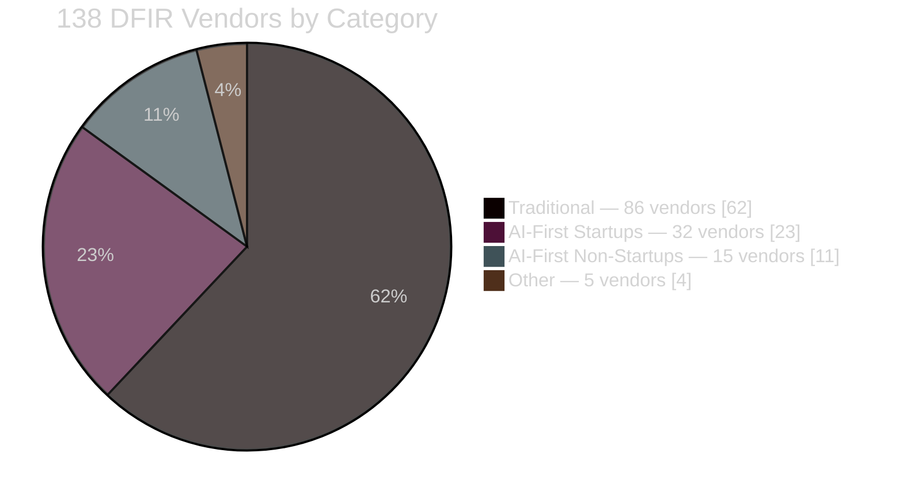
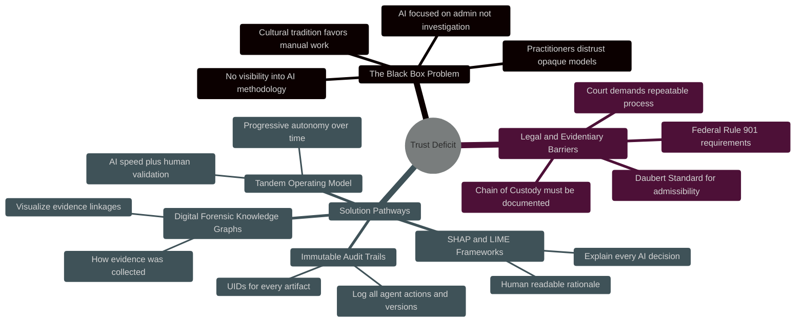
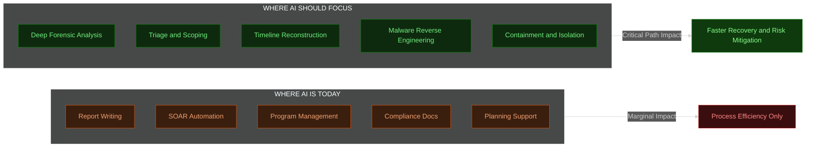
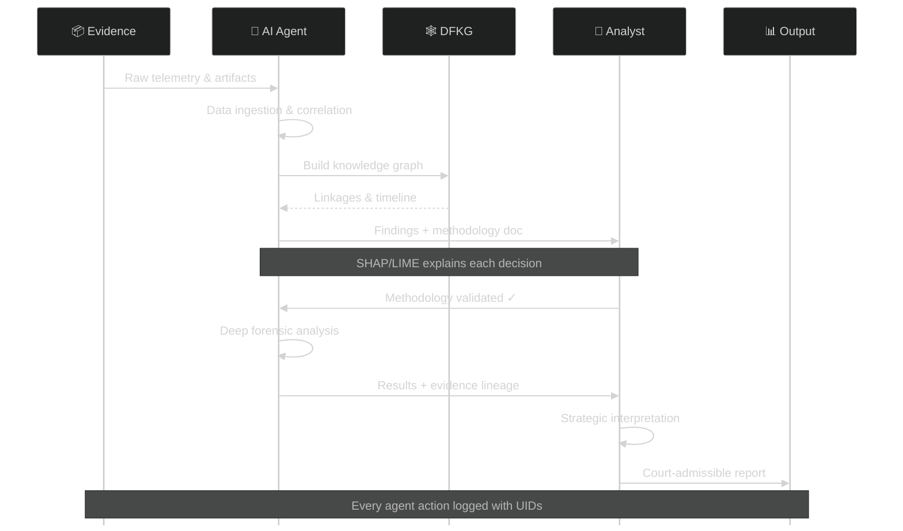
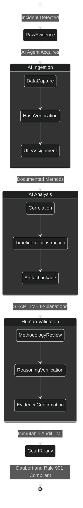
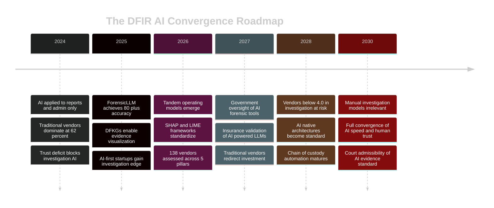

# DFIR Market Insight — Story Arc Diagrams

> **Preview in VS Code:** `Ctrl+Shift+V` to see all Mermaid diagrams rendered.
> These diagrams also render in the web app's Graphics tab under Market Insights (DFIR schema).

---

## 1. The DFIR Market Landscape

138 vendors analyzed across three distinct investment profiles.

**Key Insight:** Traditional vendors (62%) average 3.92 across five capability pillars. AI-first startups (23%) average 4.11, outperforming significantly on the investigative critical path.

---

## 2. The Trust Barrier — Why AI Adoption Stalls

Trust — not capability — is the primary barrier to AI adoption in DFIR.

**Bottom Line:** Frameworks like SHAP and LIME already exist to satisfy chain of custody, Daubert, and Federal Rule 901 requirements — the barrier is adoption, not technology.

---

## 3. From Detection Tool to Methodology Engine

The core transformation: AI evolving from automating reports and admin to powering the investigative critical path.

**The Shift:** ForensicLLM achieves 80%+ accuracy in source attribution. AI-first startups score +0.60 above traditional vendors in triage, containment, and malware analysis.

---

## 4. The Tandem Operating Model

Neither full automation nor manual-only approaches deliver optimal outcomes.

**Operating Principle:** AI handles data ingestion, correlation, and timeline reconstruction. Humans validate methodology and provide strategic interpretation.

---

## 5. Evidence Chain of Custody Lifecycle

How AI maintains defensible chain of custody through every stage.

---

## 6. Path to 2030 — The DFIR AI Convergence

"By 2030, the traditional models of manual, human-dependent forensic investigation will largely be irrelevant."

**Critical Threshold — 2028:** Vendors scoring below 4.0 in investigative and remediation pillars by 2028 risk being unable to compete for enterprise DFIR engagements by 2030.
