# Preemptive Cybersecurity Research Standard

**Version:** 1.0 (v2-3 holistic baseline)
**Date:** 2026-05-14
**Maintainer:** Gartner Preemptive Cybersecurity research program
**Scope:** End-to-end methodology for the Preemptive Cybersecurity vendor research program — schema definition, vendor discovery, evidence collection, scoring, rationale generation, and UI surfacing.

> **Viewing this document:** mermaid diagrams render in **VS Code Markdown Preview** (`Ctrl+Shift+V`) when the `bierner.markdown-mermaid` extension is installed, or natively on GitHub. The raw source view shows fenced ` ```mermaid ` code blocks.

This document is the canonical reference for how vendor capability scores in [Preemptive Cybersecurity Vendor 2-3 Holistic Validated.json](Preemptive%20Cybersecurity%20Vendor%202-3%20Holistic%20Validated.json) and [Preemptive Cybersecurity Vendor 3-0 SVC Pricing.json](Preemptive%20Cybersecurity%20Vendor%203-0%20SVC%20Pricing.json) are produced. Future re-runs and audits should conform to this standard.

---

## Table of Contents

1. [End-to-End Pipeline](#1-end-to-end-pipeline)
2. [Schema Definition](#2-schema-definition-preemptive_cybersecurity_schema_v2json)
3. [Vendor Seed Structure](#3-vendor-seed-structure)
4. [URL Discovery & Curation](#4-url-discovery--curation)
5. [Playwright Rendering](#5-playwright-rendering)
6. [Evidence Harvesting](#6-evidence-harvesting)
7. [Holistic Per-Criterion Scoring](#7-holistic-per-criterion-scoring-_revalidate_precyber_scoringpy)
8. [Worked Example: Mandiant EXM-04](#8-worked-example-mandiant-exm-04-from-475--225)
9. [Structured Rationale Overlay](#9-structured-rationale-overlay)
10. [Output Files & Versioning](#10-output-files--versioning)
11. [Operational Runbook](#11-operational-runbook)
12. [Validation Targets (Polarity Test)](#12-validation-targets-polarity-test)
13. [Anti-Patterns & Common Failures](#13-anti-patterns--common-failures)
14. [Known Limitations](#14-known-limitations)
15. [File Map](#15-file-map)
16. [Change Log](#16-change-log)

---

## 1. End-to-End Pipeline

The full lifecycle from schema authorship to UI surfacing. Each stage is **deterministic and idempotent**: re-running with the same cache produces the same scores.

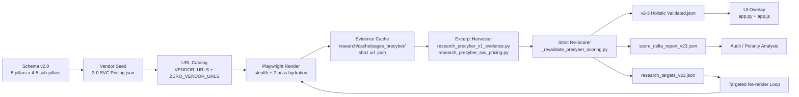

**Stage responsibilities:**

| Stage | Inputs | Outputs | Cacheable? |
|---|---|---|---|
| Schema | analyst | `Preemptive_Cybersecurity_Schema_v2.json` | n/a (versioned) |
| Seed | analyst + schema | vendor records in 3-0 file | n/a |
| URL Catalog | analyst + vendor specialization | `ZERO_VENDOR_URLS` dict | code |
| Render | URL list | `sha1(url).json` page cache | yes (file-based) |
| Harvest | page cache + schema search_terms | `sub_pillar_evidence` blocks | implicit |
| Re-score | evidence + schema | structured rationale + scores | no (always re-run) |
| Polarity audit | re-score output | console report | no |

**Trigger matrix** — what change forces what re-run:

| Change | Re-render? | Re-harvest? | Re-score? |
|---|:---:|:---:|:---:|
| New schema sub-pillar | ❌ | ✅ | ✅ |
| New `search_terms` synonyms | ❌ | ✅ | ✅ |
| Scoring algorithm tweak | ❌ | ❌ | ✅ |
| New vendor seed | ✅ (vendor only) | ✅ | ✅ |
| Bot-walled pages discovered | ✅ (`--headed`) | ✅ | ✅ |

---

## 2. Schema Definition (`Preemptive_Cybersecurity_Schema_v2.json`)

Five pillars, **24 sub-pillars** total. Every sub-pillar carries the four fields the scorer depends on.

### 2.1 Taxonomy

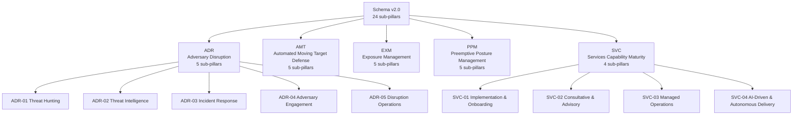

### 2.2 Sub-pillar field contract

Every sub-pillar **must** carry these four fields:

| Field | Purpose | Used by |
|---|---|---|
| `name` | Short label | UI, reports |
| `expanded_definition` | Plain-language scope | Analyst review |
| `what_to_verify_publicly` | List of testable capability claims | **Scorer** (each becomes a per-criterion verdict) |
| `search_terms` | Synonyms vendors actually use in marketing | **Scorer anchors** + **Harvester queries** |
| `maturity_guidance` | L1–L5 prose definitions | Justification text + analyst review |

**Rule:** When you add or rename a criterion, add the synonym list to `search_terms` in the same commit. The scorer's anchor matching depends on both.

### 2.3 Example sub-pillar definition

```jsonc
"SVC-01": {
  "name": "Implementation & Onboarding",
  "expanded_definition": "Vendor's ability to deploy, configure and bring a customer to operational steady-state.",
  "what_to_verify_publicly": [
    "Documented onboarding methodology with phases and milestones",
    "Onboarding documentation, runbooks, and knowledge transfer programs",
    "Time-to-value commitments (days to initial detection, weeks to full deployment)",
    "Post-deployment validation and tuning services",
    "API-first integration architecture supporting custom workflows"
  ],
  "search_terms": [
    "professional services", "onboarding", "time-to-value",
    "deployment services", "implementation services", "white-glove"
  ],
  "maturity_guidance": {
    "L1": "Self-service deployment, no formal onboarding program.",
    "L3": "Documented onboarding methodology with assigned engineers.",
    "L5": "Time-to-value SLAs, named program manager, success metrics in contract."
  }
}
```

---

## 3. Vendor Seed Structure

The canonical vendor file is [Preemptive Cybersecurity Vendor 3-0 SVC Pricing.json](Preemptive%20Cybersecurity%20Vendor%203-0%20SVC%20Pricing.json) — a flat JSON list, currently **55 vendors**.

### 3.1 Seed schema

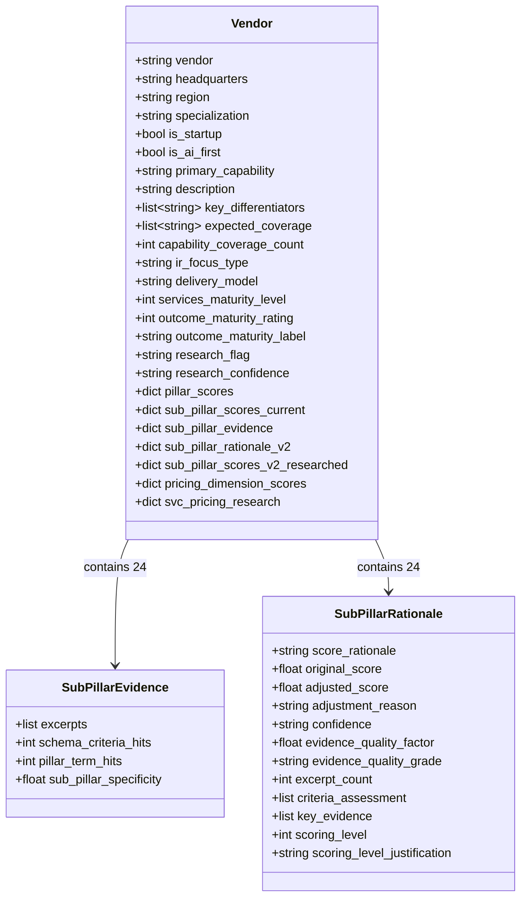

### 3.2 Required fields when seeding

```jsonc
{
  "vendor": "PwC",
  "headquarters": "London, UK",
  "region": "Global",
  "specialization": "Cybersecurity Consulting & Managed Services",
  "primary_capability": "SVC",
  "expected_coverage": ["SVC-01","SVC-02","SVC-03","SVC-04","EXM-04","ADR-02","ADR-03","PPM-03"],
  "delivery_model": "Consulting + Managed Services",
  "services_maturity_level": 5,
  "outcome_maturity_rating": 4,
  "outcome_maturity_label": "Outcome-Aligned",
  "research_flag": "seed_consultancy_benchmark"
}
```

`expected_coverage` is the analyst-asserted capability footprint. The scorer uses it to apply a small within-level lift (+0.25) when partial evidence exists, but **never** to bypass the L3 met-≥1 requirement.

[_add_consultancies.py](_add_consultancies.py) is the canonical pattern for seeding new vendors.

---

## 4. URL Discovery & Curation

Two URL catalogs feed Playwright:

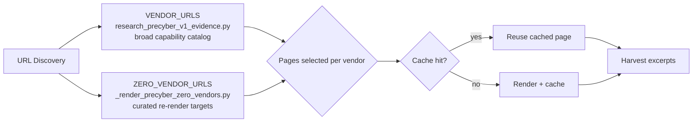

### 4.1 Curation rules

| Rule | Why |
|---|---|
| 8–12 URLs per vendor | Excerpts cap at 80 per vendor; >12 URLs has diminishing returns |
| Prefer `/products/*`, `/platform/*`, `/services/*` | Capability-dense |
| Avoid `/about`, `/news`, `/press-releases` | Marketing noise |
| Include 1–2 datasheets / white-paper landing pages | Often enumerate criteria explicitly |
| For consultancies, target `/services/cybersecurity/*`, `/insights/*` | Closest to capability claims |
| Avoid blog posts deeper than top-level | Time-bound, not capability claims |
| Add `/pricing` if available | Drives PRC-* sub-dimensions |

### 4.2 Curation by vendor archetype

| Archetype | URL pattern |
|---|---|
| EDR/XDR | `/platform`, `/endpoint`, `/services/managed-detection`, `/threat-intel` |
| BAS | `/platform`, `/use-cases/breach-attack-simulation`, `/integrations` |
| Vulnerability Mgmt | `/products`, `/exposure-management`, `/research`, `/datasheets` |
| MDR | `/services/mdr`, `/soc-as-a-service`, `/platform`, `/onboarding` |
| Consultancy | `/services/cybersecurity`, `/services/cyber-resilience`, `/insights/security` |
| Mega-platform | `/cortex`, `/products/security`, `/platform`, `/unit42` |

---

## 5. Playwright Rendering

[_render_precyber_zero_vendors.py](_render_precyber_zero_vendors.py) is the canonical renderer. It writes one JSON per URL keyed by `sha1(url)` to `research/cache/pages_precyber/`.

### 5.1 Render flow

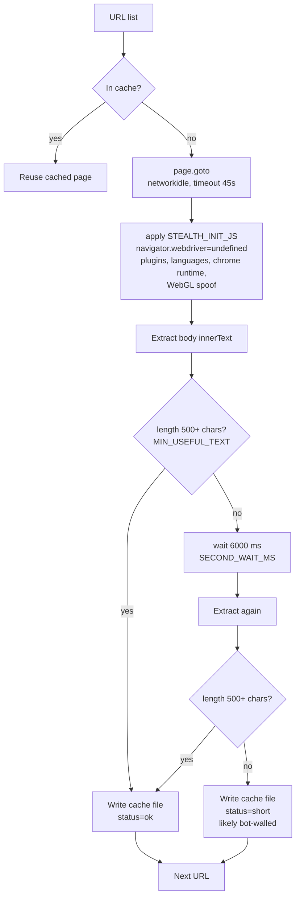

### 5.2 Operational settings

```python
CONCURRENCY     = 2     # polite; many vendor sites rate-limit at 4+
MIN_USEFUL_TEXT = 500   # below this, treated as bot-blocked
SECOND_WAIT_MS  = 6000  # extra wait for SPA hydration
```

### 5.3 Stealth fingerprint patches

The init script clears the most obvious headless-Chromium tells. Sufficient for Vercel/Cloudflare "easy" challenges; not a full anti-bot framework.

```javascript
// Excerpt from STEALTH_INIT_JS
Object.defineProperty(navigator, 'webdriver', { get: () => undefined });
Object.defineProperty(navigator, 'languages', { get: () => ['en-US', 'en'] });
Object.defineProperty(navigator, 'plugins', {
  get: () => [1,2,3,4,5].map(() => ({ name: 'Chrome PDF Plugin' }))
});
window.chrome = { runtime: {}, loadTimes: () => ({}), csi: () => ({}) };
// WebGL vendor / renderer spoof
WebGLRenderingContext.prototype.getParameter = function (parameter) {
  if (parameter === 37445) return 'Intel Inc.';
  if (parameter === 37446) return 'Intel Iris OpenGL Engine';
  return getParameter.call(this, parameter);
};
```

### 5.4 Bot-wall detection signals

| Signal | Action |
|---|---|
| Cache file < 1 KB | Likely placeholder; flag for `--headed` retry |
| `status="short"` | Two-pass hydration failed; flag |
| 888-byte placeholder body (Deloitte SPA) | JS-challenge gate; treat as real "no public capability density" |
| HTML contains "access denied", "verify you are a human", "perimeterx" | Detected; written to cache as blocked |
| HTML < 4000 chars | `_looks_bot_blocked()` returns True |

### 5.5 Bot-wall recovery

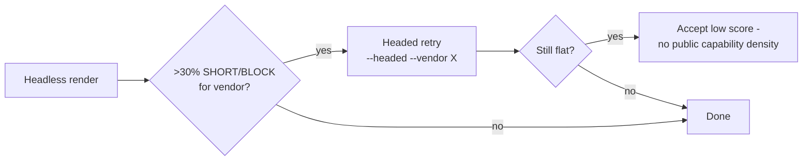

---

## 6. Evidence Harvesting

Two harvesters consume the page cache and emit per-sub-pillar evidence blocks back into the vendor record:

| Harvester | Writes |
|---|---|
| [research_precyber_v1_evidence.py](research_precyber_v1_evidence.py) | `sub_pillar_evidence[sid]` = `{excerpts:[{url,excerpt}], schema_criteria_hits, pillar_term_hits, sub_pillar_specificity}` |
| [research_precyber_svc_pricing.py](research_precyber_svc_pricing.py) | `pricing_evidence`, `svc_pricing_research`, SVC-* and PRC-* dimension scores |

### 6.1 Excerpt selection logic

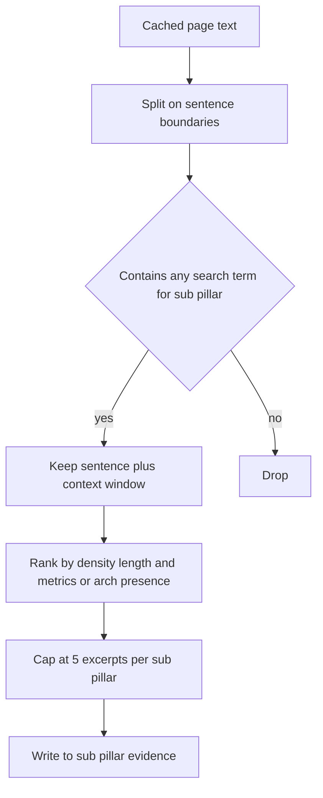

`excerpts_total` per vendor is bounded ≈ 80 (= 5 × ~16 active sub-pillars).

---

## 7. Holistic Per-Criterion Scoring (`_revalidate_precyber_scoring.py`)

The heart of the v2-3 standard. Every cell (`vendor × sub-pillar`) is re-scored from raw excerpts using a **multi-anchor, density-aware** evaluator.

### 7.1 Anchor construction

For each `criterion` × `search_terms`, build the anchor list:

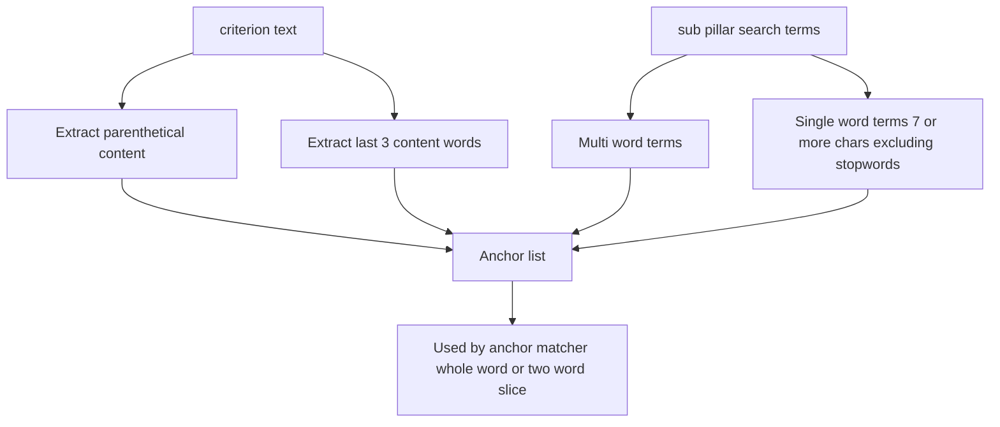

**Why multi-anchor?** The criterion text alone (e.g., *"Time-to-value commitments (days to initial detection, weeks to full deployment)"*) rarely appears verbatim. Vendors paraphrase using terms like *"professional services"*, *"managed services"*, *"time-to-value"*, *"onboarding"* — exactly the strings curated in `search_terms`. Combining both sources lets the scorer recognize paraphrased capability claims while still rejecting unrelated marketing copy.

### 7.2 Per-excerpt support score

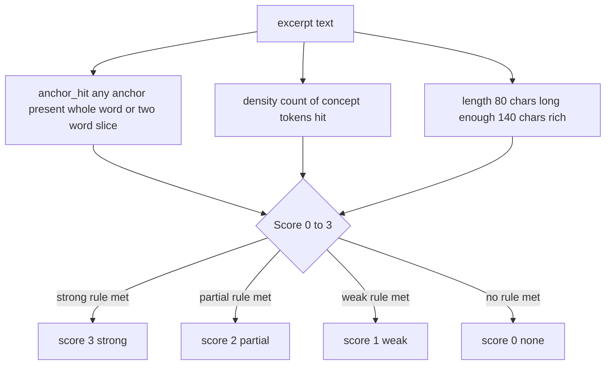

### 7.3 Aggregation to per-criterion verdict

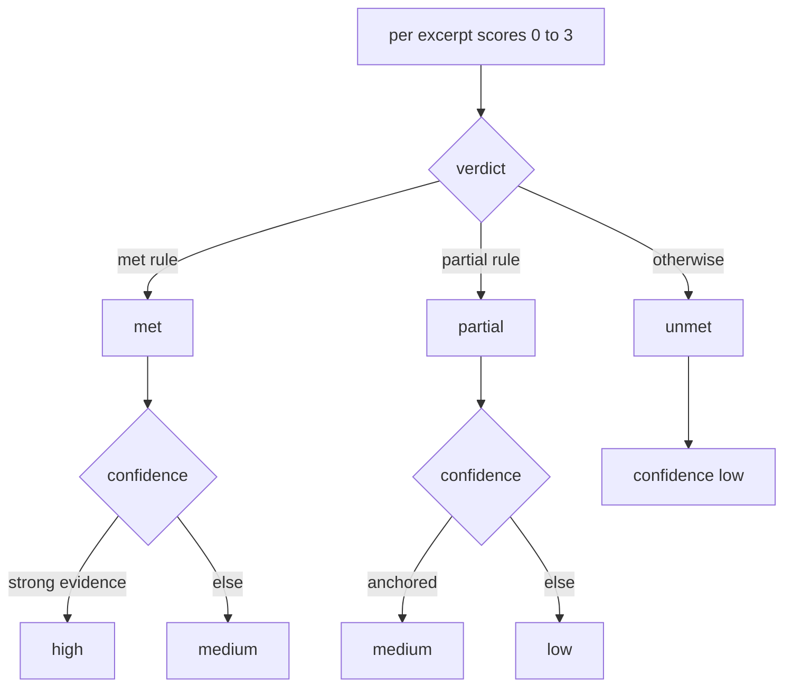

### 7.4 Sub-pillar level (L0–L5)

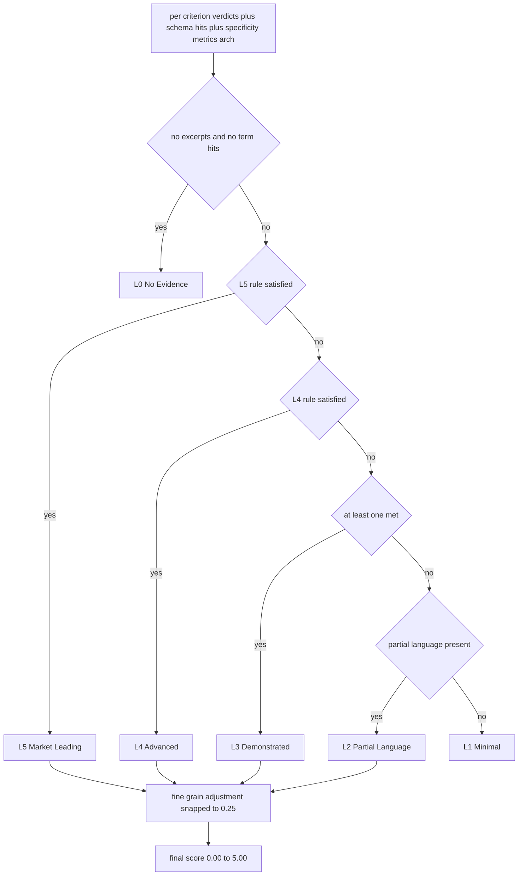

**Critical rule:** Bare schema-keyword hits **never** promote past L2. L3 strictly requires `met_count ≥ 1` — at least one criterion verifiably satisfied by an excerpt.

### 7.5 Fine-grain math

```python
# inside fine_grain()
fine_ratio = (met_count + 0.3 * partial_count) / total_criteria
adjusted   = level + 0.5 * min(fine_ratio, 1.0)
final      = round(adjusted * 4) / 4   # snap to 0.25 steps
```

| Level | met | partial | total | fine_ratio | adjusted | final |
|:---:|:---:|:---:|:---:|---:|---:|:---:|
| 2 | 0 | 1 | 5 | 0.060 | 2.030 | **2.00** |
| 2 | 0 | 5 | 5 | 0.300 | 2.150 | **2.25** |
| 3 | 1 | 0 | 5 | 0.200 | 3.100 | **3.00** |
| 3 | 1 | 3 | 5 | 0.380 | 3.190 | **3.25** |
| 4 | 2 | 1 | 5 | 0.460 | 4.230 | **4.25** |
| 4 | 3 | 2 | 5 | 0.720 | 4.360 | **4.50** |
| 5 | 4 | 1 | 5 | 0.860 | 5.430 → cap | **5.00** |

### 7.6 Evidence quality factor

`evidence_quality_factor` is a 0–1 score combining:

$$
Q = 0.30 \cdot \frac{\text{excerpts}}{5} + 0.25 \cdot \frac{\text{sources}}{4} + 0.20 \cdot \text{met\_ratio} + 0.15 \cdot \text{partial\_ratio} + 0.10 \cdot [\text{has\_metrics\_or\_arch}]
$$

Mapped to letter grade:

| Q range | Grade |
|---|:---:|
| ≥ 0.85 | A |
| 0.70–0.84 | B |
| 0.55–0.69 | C |
| 0.40–0.54 | D |
| < 0.40 | F |

---

## 8. Worked Example: Mandiant EXM-04 (from 4.75 → 2.25)

This is the canonical example of why the holistic re-score exists. Pre-v2-2, Mandiant's EXM-04 (Third-Party & Supply Chain Exposure) was scored **4.75/5.0** based on schema-keyword density alone. The strict re-score correctly drops it to **2.25/5.0**.

### 8.1 Input evidence

```
sub_pillar_evidence["EXM-04"]:
  excerpts: 5
  sources:  3 (mandiant.com pages)
  schema_criteria_hits: 3
  pillar_term_hits:     10
  sub_pillar_specificity: 4.0
```

Top excerpt (used for all 5 criteria):
> *"Solution to modernize your governance, risk, and compliance function with automation. Software Supply Chain Security"*

### 8.2 Per-criterion evaluation

| # | Criterion | anchor_hit | density | length | score | status |
|---|---|:---:|:---:|---:|:---:|---|
| 1 | Third-party vendor risk assessment capabilities | ✓ (`supply chain`) | 2 | 105 | 2 | partial |
| 2 | Software supply chain monitoring (SBOM analysis) | ✓ (`supply chain`) | 2 | 105 | 2 | partial |
| 3 | Open-source component vulnerability tracking | ✓ (`supply chain`) | 2 | 105 | 2 | partial |
| 4 | Continuous monitoring of vendor security posture | ✓ (`supply chain`) | 2 | 105 | 2 | partial |
| 5 | Supply chain attack detection and alerting | ✓ (`supply chain`) | 2 | 105 | 2 | partial |

→ `met=0, partial=5, unmet=0` of 5

### 8.3 Level decision

```
L5? met≥3 AND schema_hits≥3 AND coverage≥0.6 AND spec≥4 AND metrics AND arch
    met=0  → NO

L4? met≥2 AND schema_hits≥2 AND spec≥3 AND (metrics OR arch)
    met=0  → NO

L3? met ≥ 1
    met=0  → NO

L2? schema_hits≥2 OR partial≥1
    schema_hits=3, partial=5 → YES
    → Level = 2 (Partial Language)

fine = (0 + 0.3·5) / 5 = 0.30
adjusted = 2 + 0.5 · 0.30 = 2.15
final = round(2.15 · 4) / 4 = 2.25
```

### 8.4 Resulting structured rationale

```jsonc
{
  "score_rationale": "EXM-04 – Third-Party & Supply Chain Exposure: Score 2.25/5.0 (Level 2). Confidence: medium. Partial language: schema_hits=3, 5 partial / 0 met of 5; no criterion verifiably satisfied. ... Original v2 score was 4.75 (Δ-2.50).",
  "original_score": 4.75,
  "adjusted_score": 2.25,
  "adjustment_reason": "Strict revalidation (Level 2): 0/5 met, 5 partial. Holistic per-criterion match against schema 'what_to_verify' with anchor-phrase + concept-density + multi-excerpt corroboration.",
  "confidence": "medium",
  "evidence_quality_factor": 0.64,
  "evidence_quality_grade": "C",
  "scoring_level": 2,
  "scoring_level_justification": "Partial language: schema_hits=3, 5 partial / 0 met of 5; no criterion verifiably satisfied."
}
```

**Why this is correct:** Mandiant *mentions* supply-chain security in its GRC pitch but does not enumerate any of the five testable claims (no SBOM tool, no vendor-posture monitoring product, no supply-chain attack detection feature). The 4.75 was inflated by a single repeated phrase. The 2.25 reflects "language present, no capability verifiable from public marketing."

---

## 9. Structured Rationale Overlay

For every cell, the scorer emits a structured rationale block written to `sub_pillar_rationale_v2[sid]`. This is the contract the UI reads.

### 9.1 Schema

```jsonc
{
  "score_rationale": "<vendor> exhibits <Level-name> capability in <SID> ...",
  "original_score": 3.5,
  "adjusted_score": 2.0,
  "adjustment_reason": "Strict revalidation (Level N): X/Y met, Z partial. ...",
  "confidence": "high|medium|low",
  "evidence_quality_factor": 0.62,
  "evidence_quality_grade": "A|B|C|D|F",
  "evidence_quality_rationale": "Evidence quality: 62% — Grade C. ...",
  "excerpt_count": 5,
  "criteria_assessment": [
    { "criterion": "...", "status": "met|partial|unmet",
      "evidence": "<snippet ≤ 220 chars>", "confidence": "high|medium|low" }
  ],
  "key_evidence": ["snippet1", "snippet2", "snippet3", "snippet4"],
  "scoring_level": 2,
  "scoring_level_justification": "Partial language: schema_hits=3, ..."
}
```

### 9.2 UI surfacing path

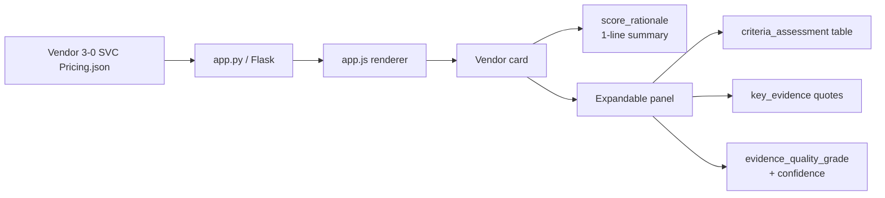

The pre-overlay state is preserved at `sub_pillar_rationale_v2_pre_v22` for diff/audit.

---

## 10. Output Files & Versioning

| File | Role | State |
|---|---|---|
| Vendor 1-0 Seed | Original analyst seed | Frozen |
| Vendor 1-1 Validated | First validation pass | Frozen |
| Vendor 2-0 Researched | Initial automated research | Frozen |
| Vendor 2-1 Consolidated | Cross-vendor consolidation | Frozen |
| Vendor 2-2 Validated | Strict re-score baseline (single-anchor) | **Audit baseline — keep** |
| Vendor 2-3 Holistic Validated | Holistic re-score (multi-anchor) | **Live standard** |
| Vendor 3-0 SVC Pricing | Canonical UI source — full superset | **Live (read by app.py)** |
| `precyber_score_delta_report_v23.json` | Per-cell delta vs prior version | Per re-run |
| `precyber_research_targets_v23.json` | Cells flagged for fresh scraping | Per re-run |

### 10.1 Versioning rule

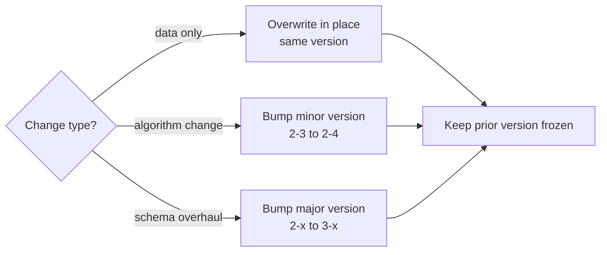

**Never overwrite a frozen file.** Frozen files are immutable audit references.

---

## 11. Operational Runbook

### 11.1 Add a new vendor

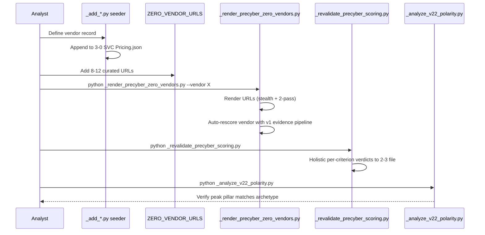

### 11.2 Standard re-run commands

```powershell
# Full re-render + rescore for one vendor
$env:PYTHONIOENCODING='utf-8'
.\.venv\Scripts\python.exe _render_precyber_zero_vendors.py --vendor "Palo Alto Networks"

# Headed retry for bot-walled vendor
.\.venv\Scripts\python.exe _render_precyber_zero_vendors.py --vendor PwC --headed

# Re-score all vendors (no render)
.\.venv\Scripts\python.exe _revalidate_precyber_scoring.py

# Polarity audit
.\.venv\Scripts\python.exe _analyze_v22_polarity.py

# Compression diagnostics (if scores look flat)
.\.venv\Scripts\python.exe _diag_compression.py
```

### 11.3 Re-score after schema change

```powershell
$env:PYTHONIOENCODING='utf-8'
.\.venv\Scripts\python.exe _revalidate_precyber_scoring.py
.\.venv\Scripts\python.exe _analyze_v22_polarity.py
```

No render needed — the cache is unchanged. Schema additions to `search_terms` will alter anchor sets and may shift per-criterion verdicts; check `precyber_score_delta_report_v23.json` for the per-cell diff.

### 11.4 Bot-walled vendor recovery

If render output shows many `SHORT` / `BLOCK` lines:

```powershell
.\.venv\Scripts\python.exe _render_precyber_zero_vendors.py --vendor X --headed
```

A visible Chromium clears most bot walls (PwC, Palo Alto). Some heavy SPAs (e.g., `www2.deloitte.com`) return 888-byte placeholder bodies regardless — that's a real signal: their public pages don't carry capability density and the low score is correct.

---

## 12. Validation Targets (Polarity Test)

The standard is calibrated against archetype expectations. Each archetype should peak in its expected pillar with a clear delta over the rest.

### 12.1 Reference table (v2-3 actuals)

| Vendor archetype | Expected peak pillar | Reference vendor & score (v2-3) |
|---|---|---|
| Threat Intelligence / DRP | ADR | Group-IB ADR=3.40 |
| EDR / XDR | ADR | CrowdStrike ADR=2.85 |
| BAS | PPM | Cymulate PPM=3.20, AttackIQ PPM=2.90 |
| Vulnerability Management | EXM | Tenable EXM=3.20, Qualys EXM=3.10 |
| CAASM | EXM | Axonius EXM=3.15 |
| MDR | SVC + EXM | Arctic Wolf EXM=2.70 / SVC=2.25 |
| Security Ratings | SVC + EXM | Bitsight SVC=2.75 / EXM=2.70 |
| Mega-Platform | EXM peak | Palo Alto Networks μ=2.60, EXM=3.30 |
| Big-3 Consultancy | flat (public-web blind spot) | PwC/Accenture/Deloitte μ ≈ 1.2–1.5 |

### 12.2 Distribution sanity (55 vendors × 24 cells = 1,320 cells)

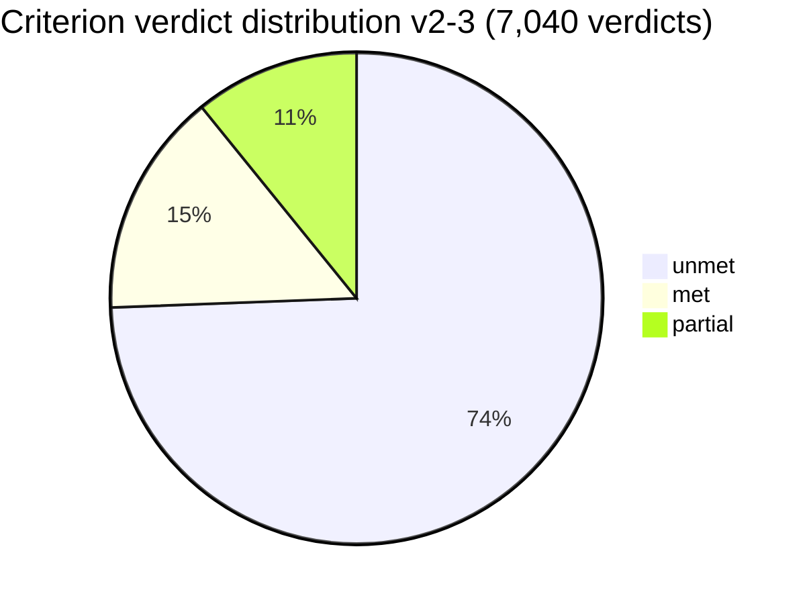

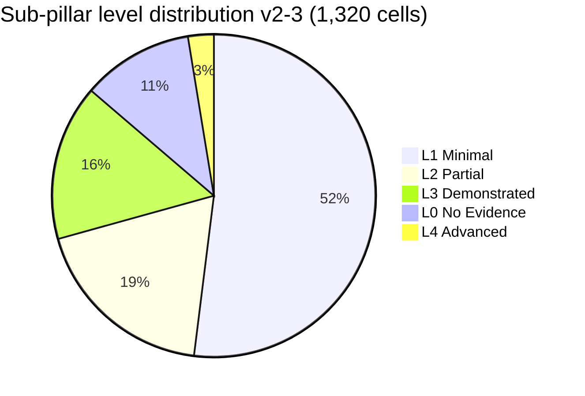

**Drift threshold:** If a re-run drifts >5% on any of these distributions, audit the anchor logic before promoting.

---

## 13. Anti-Patterns & Common Failures

| Anti-pattern | Symptom | Fix |
|---|---|---|
| Single-anchor scorer (pre-v2-3) | 96% unmet rate; mean ≤ 1.2; flat distribution | Multi-anchor: parenthetical + last-3-words + all multi-word search_terms |
| Schema-keyword promotion to L3+ | Vendor scores 4.75 with 0/5 criteria met | L3 strictly requires `met_count ≥ 1` |
| Excerpt under 80 chars driving "met" | Marketing tagline wins | `_MIN_EXCERPT_LEN_FOR_SUPPORT = 80` |
| Bot-walled cache treated as evidence | Vendor scored on 888-byte placeholders | `MIN_USEFUL_TEXT = 500` + `_looks_bot_blocked()` |
| Overwriting frozen files | Audit history lost | Bump version on algorithm change |
| Adding criteria without `search_terms` | Anchor list collapses to derived-only | Schema lint: every criterion change ships with synonyms |
| Concurrency > 2 | Rate-limit responses misread as content | Keep `CONCURRENCY = 2` |
| No `--headed` retry for known SPAs | Whole-vendor flat profile | Document required `--headed` vendors |

---

## 14. Known Limitations

1. **Public-web blind spot for consultancies.** PwC, Accenture, Deloitte score flat (μ ≈ 1.2–1.5) because their marketing copy is brand-level, not capability-specific. **This is a real finding for the public-web evidence band, not a scoring bug.** Promoting them requires a different evidence source (analyst profiles, RFP narratives, case studies).
2. **Bot walls bias evidence volume.** Vendors with aggressive bot-detection get fewer cached pages and therefore systematically less evidence. Use `--headed` retries and document `excerpts_total` per vendor in audits.
3. **No semantic embeddings.** The scorer uses lexical anchors + concept density, not embeddings. This is intentional (deterministic, auditable, fast) but misses pure paraphrase that doesn't share vocabulary.
4. **Per-criterion verdicts re-use the same best-snippet.** When all five criteria of a sub-pillar match the same dense passage, they all get "partial". The scorer doesn't distinguish "five criteria each verified by different evidence" from "one passage tagged five times" — the level rubric corrects this through the `met_count` requirement.
5. **No temporal weighting.** A 2019 datasheet and a 2026 product page count equally. Acceptable today; revisit if the corpus drifts older than 2 years.

---

## 15. File Map

| Concern | File |
|---|---|
| Schema | [Preemptive_Cybersecurity_Schema_v2.json](Preemptive_Cybersecurity_Schema_v2.json) |
| Vendor canonical | [Preemptive Cybersecurity Vendor 3-0 SVC Pricing.json](Preemptive%20Cybersecurity%20Vendor%203-0%20SVC%20Pricing.json) |
| Holistic v2-3 | [Preemptive Cybersecurity Vendor 2-3 Holistic Validated.json](Preemptive%20Cybersecurity%20Vendor%202-3%20Holistic%20Validated.json) |
| Strict v2-2 baseline | [Preemptive Cybersecurity Vendor 2-2 Validated.json](Preemptive%20Cybersecurity%20Vendor%202-2%20Validated.json) |
| Renderer | [_render_precyber_zero_vendors.py](_render_precyber_zero_vendors.py) |
| Evidence harvester | [research_precyber_v1_evidence.py](research_precyber_v1_evidence.py) |
| Pricing harvester | [research_precyber_svc_pricing.py](research_precyber_svc_pricing.py) |
| Re-scorer | [_revalidate_precyber_scoring.py](_revalidate_precyber_scoring.py) |
| Polarity analysis | [_analyze_v22_polarity.py](_analyze_v22_polarity.py) |
| Holistic check | [_check_v22_holistic.py](_check_v22_holistic.py) |
| Compression diagnostics | [_diag_compression.py](_diag_compression.py) |
| UI server | [app.py](app.py) |
| Vendor seeder example | [_add_consultancies.py](_add_consultancies.py) |
| Delta report | [precyber_score_delta_report_v23.json](precyber_score_delta_report_v23.json) |
| Research targets | [precyber_research_targets_v23.json](precyber_research_targets_v23.json) |

---

## 16. Change Log

| Date | Change | Files |
|---|---|---|
| 2026-05-14 | Holistic v2-3 baseline established. Multi-anchor (criterion + search_terms) per-criterion evaluator. Big-3 consultancies seeded as benchmark. Tech-vendor URL set extended (SentinelOne, Darktrace, Lacework, Palo Alto, Cisco/Splunk). | `_revalidate_precyber_scoring.py`, `_render_precyber_zero_vendors.py`, `_add_consultancies.py`, 2-3 + 3-0 JSON |
| 2026-05-14 | v2-2 strict baseline (single-anchor) frozen for audit comparison. | [Preemptive Cybersecurity Vendor 2-2 Validated.json](Preemptive%20Cybersecurity%20Vendor%202-2%20Validated.json) |
| 2026-05-14 | Standards document v1.0 published. | [PreCyber_Research_Standard.md](PreCyber_Research_Standard.md) |
