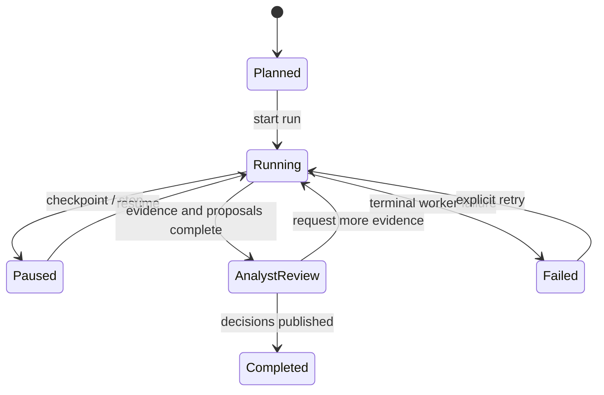

# Research state machine

Each run links to a versioned research policy. Targets progress through
discovery, retrieval/rendering, extraction, scoring, and review with a durable
checkpoint after every successful batch. A lease/heartbeat field is reserved
for future concurrent workers.

Retrieval attempts append immutable snapshots, including blocked and failed
attempts. Bot-wall and retry history is therefore preserved. Positive score
proposals require evidence; an explicit level-zero proposal may have no
evidence. Only an analyst review decision can publish a canonical score.

Invalid records go to the operations dead-letter family with validation errors
and provenance. Workers may use compatibility file checkpoints only when no
CouchDB project and run IDs are supplied; production runs must supply both.
